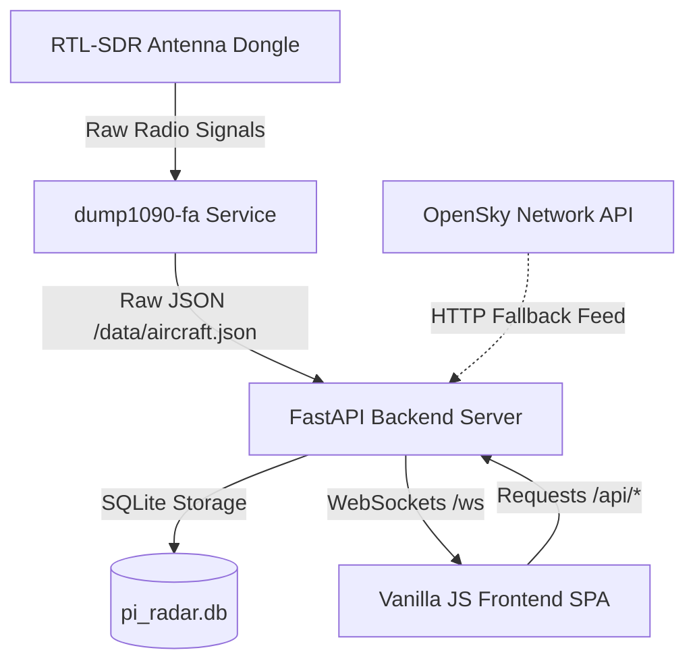

# Guidelines and Architecture for AI Coding Agents

Welcome! If you are an AI assistant tasked with maintaining, debugging, or extending the **Pi Radar** application, this document provides the key architectural context, design principles, and guidelines to help you work efficiently.

---

## 1. Architectural Overview

Pi Radar is a real-time ADS-B flight radar application designed to run on a Raspberry Pi and serve a local web interface. 

### Component Interaction

### Key Components:
1. **RTL-SDR Hardware + Decoder (`dump1090-fa`)**: Decodes 1090 MHz Mode S radio transmissions from nearby planes.
2. **FastAPI Backend**:
   - Manages connections, coordinates geolocation details, and pulls from the local decoder.
   - Automatically falls back to the **OpenSky Network API** if the RTL-SDR hardware is offline or missing.
   - Caches flight path tracks (1-hour window) and aircraft registry metadata in SQLite (`pi_radar.db`).
   - Broadcasts live data updates every 5 seconds to all connected browsers over **WebSockets**.
3. **HTML5 Canvas Frontend**:
   - Rendered entirely on 2D HTML5 canvas layers.
   - Utilizes OpenStreetMap (OSM) tile imagery for the background map.

---

## 2. Directory Structure & File Index

* `/config.yaml` — Central application configuration. Any dynamic URL, screen sizing, or coordinate variables must be externalized here.
* `/backend/` — FastAPI application files.
  * `main.py` — Application entry point, lifetime hooks, WebSocket router, and background thread loops.
  * `config.py` — Pydantic schema validation for config values.
  * `data_manager.py` — In-memory state tracking, history persistence, and geographic math.
  * `db/database.py` — SQLite track history and Mode-S cache management.
  * `sources/` — Poller abstraction. Contains `dump1090_source.py`, `opensky_source.py`, and `mock_source.py`.
  * `api/` — REST API router endpoints.
* `/frontend/` — Single Page Application assets.
  * `index.html` — HTML structure.
  * `css/` — CSS styling (Vanilla styling, phosphor green themes).
  * `js/` — Modular render engine scripts:
    * `app.js` — Main coordinator, WebSocket connection manager, config loader.
    * `map.js` — Tile loader and render loop for the OpenStreetMap background.
    * `radar.js` — Compass, range rings, crosshairs (drawn to offscreen canvas for performance).
    * `sweep.js` — Rotating sweep line animation (runs at 60fps).
    * `aircraft.js` — Aircraft blips, plane silhouettes, flight trails, and click/touch selection.
    * `ui.js` — Details panel display, sidebar states, clock, and altitude sliders.

---

## 3. Core Design Patterns

### Performant Multi-Layered Canvas
To maximize performance on low-power devices like the Raspberry Pi, the radar display is divided into **four separate canvas overlays** stacked via CSS absolute positioning:
1. **Layer 0 (`map-canvas`)**: Background map. Only redraws when the map zoom or coordinates change.
2. **Layer 1 (`bg-canvas`)**: Compass rose and range rings. Redrawn only on window resize.
3. **Layer 2 (`sweep-canvas`)**: Rotating radar sweep line. Redrawn at 60fps.
4. **Layer 3 (`blip-canvas`)**: Interactive layer. Draws aircraft silhouettes, airport crosshairs, and text labels. Redrawn on data refresh (every 5 seconds) or when an aircraft is hovered/selected.

> [!IMPORTANT]
> When modifying frontend rendering, **never combine these layers** or force full-screen canvas redraws of the background map inside the 60fps sweep loop. Doing so will spike CPU utilization on the Raspberry Pi.

### Caching Strategies
- **Airports API**: Queries the OpenStreetMap Overpass API and caches responses in-memory for 30 minutes. It filters out minor fields and backyard airstrips, requiring a valid 4-character ICAO code or 3-character IATA code.
- **Aircraft Metadata API**: Queries `hexdb.io` for Mode-S hex codes and caches them locally in the `aircraft_metadata` SQLite table for 7 days. It implements negative caching (caching null fields) to prevent spamming the public API for unregistered planes.
- **UI Metadata Loading**: Implements a `{ loading: true }` cache placeholder in `ui.js` to debounce rapid/parallel requests for the same aircraft Mode-S hex.

---

## 4. Key Rules and Constraints

1. **No Hardcoded Credentials or URLs**: Never add API URLs, authentication keys, credentials, or private addresses inside code files. Expose them through `config.yaml`, validate them in `backend/config.py`, and fetch them dynamically in the frontend.
2. **Offline Development Mode**: Always maintain local testing functionality. Setting `development.use_mock_source: true` in `config.yaml` starts a simulated data generator (`mock_source.py`) that populates fake flights and deterministic mock metadata.
3. **Paths and Usernames**: In helper scripts or systemd service configurations, never hardcode the user `/home/pi/`. Use dynamic placeholders and scripts like `install.sh` to resolve username (`$PI_USER`) and home paths (`$USER_HOME`) at runtime.
4. **Attribution**: The project author is **Vachaspati V**. Keep all copyright notices and licenses intact.

---

## 5. Potential Extension Areas

If you are looking to build new features, here are high-priority candidates:
* **Flight Routes Integration**: Add support for retrieving flight routes (origin/destination airports) based on callsigns. (See Aviationstack/AirLabs API).
* **Aircraft Photo Pre-fetching**: Fetch and cache planespotters.net thumbnails in the backend database rather than querying the client browser directly.
* **Audio Alerts**: Implement voice synthesized audio callouts or alarm blips when specific squawk codes (e.g. `7700` Emergency) or close proximity alerts are triggered.
