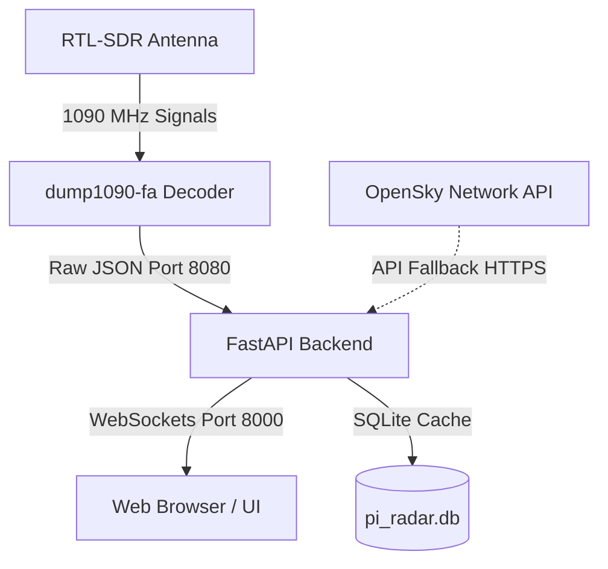
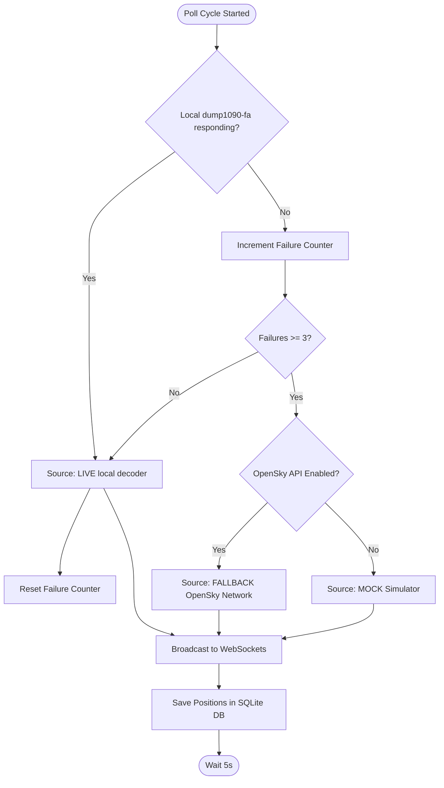

# Pi Radar — ADS-B Flight Radar

Pi Radar is a real-time, green phosphor, radar-style web application for tracking flights overhead. It is powered by a USB RTL-SDR antenna dongle decoding Mode-S ADS-B signals locally at 1090 MHz. When hardware is offline, the system seamlessly falls back to streaming state vectors from the OpenSky Network API.

Developed by **Vachaspati V**. Licensed under the GNU General Public License v3.0 (GPLv3).

### Key Features
* **Real-time 2D Canvas Radar**: Green phosphor themed stacked canvas rendering that replicates sweeps, compass rings, and aircraft blips efficiently.
* **OpenStreetMap Integration**: Beautiful interactive base map background.
* **Automatic Hardware Fallback**: Seamlessly switches from a local RTL-SDR antenna feed (`dump1090-fa`) to the OpenSky Network API, or mock simulator in offline developer mode.
* **Emergency Transponder Warning**: Siren sound (synthesized locally or using custom MP3s) and full-screen flashing red border when emergency squawks (7700, 7600, 7500) are detected, with automatic flight selection.
* **Proximity Alerts**: Circular pulsing blue radar frame warning when aircraft fly close by (under 1 NM or low-altitude under 2 NM).
* **Caching & Photo Fetching**: Caches municipal airports, PlaneSpotters thumbnail images, and flight registration databases.

---

## Architecture & Data Flow

### System Architecture
The application runs on a local web server hosted on the Raspberry Pi, serving static assets and WebSocket connections to client web browsers.



### Data Source Switch & Fallback Flow
The backend monitors the health of the local decoder and automatically switches to the OpenSky Network API fallback if local hardware is missing or offline.



---

## Hardware Prerequisites
To deploy this as a physical radar station, you will need:
* **Raspberry Pi 5** (or Pi 4 / Pi 3B+) running **Raspberry Pi OS 64-bit (Bookworm)**.
* **USB RTL-SDR Dongle** (e.g. RTL-SDR Blog V3/V4 or NooElec NESDR).
* **1090 MHz Antenna** placed near a window or outdoors.
* **Active Internet Connection** for installation and fallback map tiles.

---

## First-Time Configuration Setup

Before running the application on your Pi, you must set up the `config.yaml` file. The following variables should be configured on your first launch:

| Variable Path | Default | Description |
|---|---|---|
| `radar.home_lat` | `33.261634` | Latitude coordinates of your radar's home center. |
| `radar.home_lon` | `-96.778636` | Longitude coordinates of your radar's home center. |
| `radar.home_label` | `"Prosper, TX"` | Name of your home station displayed on the header. |
| `opensky.enabled` | `true` | Enables falling back to OpenSky API when your antenna is offline. |
| `opensky.client_id` | `""` | Your OpenSky Network API Client ID. |
| `opensky.client_secret` | `""` | Your OpenSky Network API Client Secret. |
| `fr24feed.enabled` | `true` | Set to `true` if you are sharing data to FlightRadar24. |
| `fr24feed.sharing_key` | `""` | Your FlightRadar24 feed sharing key. |
| `development.use_mock_source` | `false` | Set to `false` for live operations. Set to `true` to test locally on Windows with fake aircraft. |
| `display.photo_api_url` | *(Planespotters URL)* | The API pattern to retrieve actual aircraft photos. |
| `alerts.emergency.enabled` | `true` | Enables sirens and full-screen flashing warning for emergency transponders. |
| `alerts.emergency.squawks` | `["7700", "7600", "7500"]` | Squawk codes that trigger the emergency warning. |
| `alerts.emergency.siren_volume` | `0.1` | Volume of synthesized/custom audio (0.0 to 1.0). |
| `alerts.proximity.enabled` | `true` | Enables circular blue radar flashing warning for close-proximity flights. |
| `alerts.proximity.min_distance_nm` | `1.0` | Distance limit (NM) for proximity warning at any altitude. |
| `alerts.proximity.altitude_distance_nm` | `2.0` | Distance limit (NM) for low-altitude proximity warning. |
| `alerts.proximity.altitude_threshold_ft` | `2000` | Altitude limit (feet) for low-altitude proximity warning. |

---

## OpenSky Network Credentials Setup
OpenSky Network is a free, community-driven database of flights. Setting up credentials prevents you from hitting low public rate limits.

1. Go to **[https://opensky-network.org/](https://opensky-network.org/)** and sign up for a free account.
2. Log in and navigate to **Account** → **API Clients**.
3. Create a new API client.
4. Copy the generated **Client ID** and **Client Secret**.
5. Open `config.yaml` and paste them into the `opensky.client_id` and `opensky.client_secret` fields.

---

## FlightRadar24 Integration (`fr24feed`)
The installer lets you feed data to FlightRadar24. In exchange, you get a free **FlightRadar24 Business Subscription** worth $500/year.

1. During installation, type `y` when asked if you want to install `fr24feed`.
2. After installation, register your feed with:
   ```bash
   sudo fr24feed --signup
   ```
3. Enter your email, coordinate details, and select **Beast (TCP)** as the receiver type.
4. Provide connection settings: host as `127.0.0.1` and port as `30005`.
5. Once complete, copy the sharing key provided and save it inside your `config.yaml` in the `fr24feed.sharing_key` field.

---

## Setup & Installation on Raspberry Pi

1. Boot up your Raspberry Pi and clone this repository to your home folder:
   ```bash
   git clone https://github.com/vachaspativ/pi_radar.git /home/$USER/pi-radar
   cd /home/$USER/pi-radar
   ```
2. Start the automated installation script:
   ```bash
   sudo bash scripts/install.sh
   ```
   *This script dynamically templates systemd files to match your active user profile, configures hardware drivers, blacklists conflicting DVB TV kernel modules, and installs dependencies.*

3. Edit `/home/$USER/pi-radar/config.yaml` to specify your coordinates, API credentials, and set `development.use_mock_source: false`.

4. Restart the service to apply changes:
   ```bash
   sudo bash scripts/restart-app.sh
   ```

---

## Managing the Application

A set of automated management scripts is provided in the `scripts/` directory to simplify service control:

* **Restart Application Only (Backend & UI Kiosk)**:
  ```bash
  sudo bash scripts/restart-app.sh
  ```
* **Restart Everything (Decoder, App, Kiosk UI, & FR24 Feeder)**:
  ```bash
  sudo bash scripts/restart-all.sh
  ```
* **Stop Application Only**:
  ```bash
  sudo bash scripts/stop-app.sh
  ```
* **Stop All Components**:
  ```bash
  sudo bash scripts/stop-all.sh
  ```

### Accessing the Web UI
Open your browser and navigate to:
**[http://localhost:8000](http://localhost:8000)** (or `http://<your-pi-ip-address>:8000` from another device on your local network).

### Viewing System Logs
Logs are managed by systemd and can be streamed using `journalctl`:
* **Pi Radar App Logs**: `journalctl -u pi-radar -f`
* **Local Hardware Decoder Logs**: `journalctl -u dump1090-fa -f`
* **FR24 Feeder Logs**: `journalctl -u fr24feed -f`
